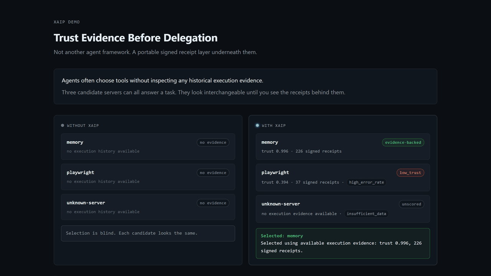
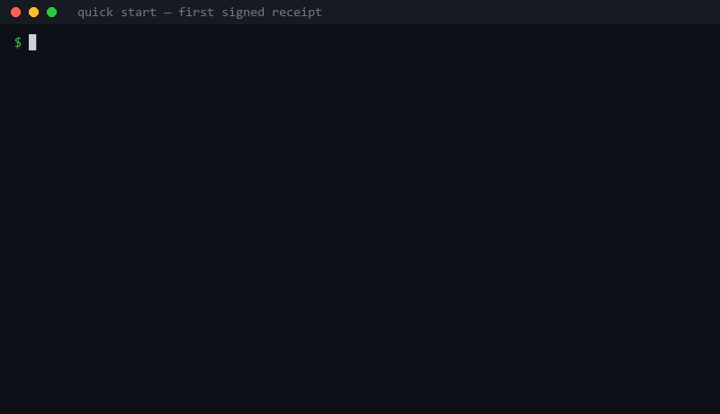

# XAIP — Signed Execution Receipts for AI Agent Tool Calls

> Evidence before delegation. Wrap an agent's tool calls once; use the receipt history locally today, and share the same signed receipts later as portable, independently verifiable evidence.

XAIP is a provider-neutral signed execution evidence layer for AI agent tool calls. It records co-signed receipts — both the executing agent and the caller sign the same canonical record, so neither side can unilaterally fabricate one — across MCP, LangChain.js, OpenAI-compatible tool-call loops, and other runtimes, then exposes historical execution evidence that agents, developers, or policy layers can inspect before delegation.

Receipts are the primary artifact. Trust scores are one derived view over those receipts — not a claim of absolute safety or correctness.

### XAIP in 30 seconds

- **Mechanism** — one tool call in, one receipt out. The executing agent and the caller sign the *same* canonical record (Ed25519 over JCS), so neither side can unilaterally fabricate or repudiate it. Only hashes of input/output are carried; content never leaves your machine.
- **What you get on day one** — a verifiable history of what your own agent's tools actually did, queryable *before* the next delegation (`precheck()`). Useful single-player; no network of other users required.
- **What XAIP is not** — not a sandbox, not an approval engine, not a payment rail, not a safety guarantee. It makes execution evidence visible; you decide what to trust.

**Pick your depth:**
[**3 minutes** — produce your first signed receipt](#quick-start--your-first-signed-receipt-in-under-5-minutes) ·
[**10 minutes** — verify the format yourself](#internet-draft): run the [executable conformance vectors](./docs/spec/test-vectors/) (`node check.mjs`, no dependencies), then skim the [Internet-Draft](https://datatracker.ietf.org/doc/draft-xkumakichi-xaip-receipts/) it pins.

[](https://xkumakichi.github.io/xaip-protocol/evidence-before-delegation.html)

*Live demo: three candidate servers, side-by-side comparison without and with XAIP. [Open in browser →](https://xkumakichi.github.io/xaip-protocol/evidence-before-delegation.html)*

**Provider-agnostic by design.** XAIP is a trust layer for any tool-using agent. The reference implementation and live data start with **MCP** (Model Context Protocol) — because that's where the broadest fleet of public tool servers exists today — but the receipt format, signing, and scoring apply equally to LangChain tools, OpenAI function calling, A2A, and proprietary agent stacks. MCP is the first integration, not the only one.

**Live dashboard:** https://xkumakichi.github.io/xaip-protocol/ — current public trust scores, auto-refreshed, no auth. The current public dataset is MCP-heavy because MCP was the first integration target.

### Entry points

- [Trust Evidence Before Delegation](./docs/evidence-before-delegation.html) — one-screen demo, live `POST /v1/select` against three contrasting candidates.
- [Before Payment Evidence Demo](./docs/before-payment-demo.html) — one-screen demo: what an agent sees about a paid closed-source skill before paying, with vs without execution evidence from `precheck()` (three fictional candidates, seeded fixture).
- [Browser playground](./docs/playground.html) — read-only demo of trust-aware selection.
- [60-second overview](./docs/agent-trust-overview.md) — the problem XAIP is trying to address.
- [Future direction](./docs/future-direction.md) — long-term hypothesis, open questions, and current research asks.
- [Single-caller dominance case study](./docs/case-study/single-caller-dominance.md) — a real failure mode surfaced in XAIP's own public dataset on 2026-05-13, and what it implies for caller diversity.
- [Agent Trust Check design](./docs/agent-trust-check-design.md) — planned diagnostic concept.
- [Class-aware scoring design](./docs/class-aware-scoring-design.md) — future design note; not live scoring behavior.
- [Emit receipts from anything](./docs/emit-from-anything.md) — how to produce XAIP receipts from any tool system.
- [precheck() API guide](./docs/precheck.md) — SDK helper for execution evidence before delegation.
- [Run xaip-caller](./docs/run-xaip-caller.md) — contribute signed receipts without running MCP.

## Try It Now

The API is live. No signup, no API key.

```bash
# Check trust score for a scored tool server
curl https://xaip-trust-api.kuma-github.workers.dev/v1/trust/context7

# Batch query
curl "https://xaip-trust-api.kuma-github.workers.dev/v1/trust?slugs=context7,sequential-thinking,filesystem"

# Decision engine: rank candidates by available execution evidence
curl -X POST https://xaip-trust-api.kuma-github.workers.dev/v1/select \
  -H "Content-Type: application/json" \
  -d '{"task":"Fetch React docs","candidates":["context7","sequential-thinking","unknown-server"]}'
```

The `/v1/select` response tells you which server to use, why, and what would happen without XAIP:

```json
{
  "selected": "context7",
  "reason": "Highest trust among scored candidates based on current verified receipts",
  "rejected": [{ "slug": "unknown-server", "reason": "unscored — no execution evidence available" }],
  "withoutXAIP": "Random selection would pick an unscored server 33% of the time — no execution evidence available"
}
```

## The Problem

Without trust scores, your agent is gambling:

```
┌────────────────┬────────────────┬───────────┬──────────────┐
│ Strategy       │ Server Hit     │ Success   │ Latency      │
├────────────────┼────────────────┼───────────┼──────────────┤
│ With XAIP      │ context7       │ ✓         │ ~3s          │
│ Random         │ unknown-mcp    │ ✗ error   │ ~8s (wasted) │
│ Try all (seq)  │ 3 servers      │ 1/3       │ ~11s total   │
└────────────────┴────────────────┴───────────┴──────────────┘
```

XAIP helps agents prefer candidates with stronger available execution evidence, skip unscored candidates when appropriate, and reduce avoidable failed calls.

## How It Works

```
1. Select    POST /v1/select → ranks candidates by available execution evidence
2. Execute   Your agent calls the selected tool server
3. Report    POST /receipts → signed execution receipt feeds back into trust scores
```

Every execution receipt is Ed25519-signed and verified. Trust scores are computed using a Bayesian model with caller diversity weighting — not self-reported metrics.

## Quick Start — your first signed receipt in under 5 minutes

The fastest path is the Claude Code hook: your normal MCP tool calls start
producing signed receipts, with nothing but hashes leaving your machine.
Measured end-to-end on a clean Windows 11 profile (Node 24, npm 11) — total
command time was about 8 seconds; the steps are identical on macOS/Linux.



*(Terminal replay rendered from the real captured outputs of that measurement — [generator script](./docs/media/make-quickstart-gif.py).)*

### 1. Install

```bash
npm install -g xaip-claude-hook
```

### 2. One command

```bash
xaip-claude-hook install
```

```
✓ XAIP Claude Code hook installed.
  C:\Users\you\.claude\settings.json

Next MCP tool call will emit a signed receipt to
  https://xaip-aggregator.kuma-github.workers.dev
```

### 3. One tool call

Open a **new** Claude Code session and let it call any MCP tool (for example,
ask it to look up a library with context7). The hook signs and submits a
receipt automatically — you do nothing.

### 4. One signed receipt

```bash
cat ~/.xaip/hook.log
```

```
2026-07-17T03:41:57.964Z POST context7/resolve-library-id ok=true lat=2402ms → 200 {"ok":true,"agentDid":"did:web:context7","callerVerified":true}
```

`callerVerified: true` is the aggregator confirming your Ed25519 caller
signature over the canonical receipt payload. Only hashes and metadata (tool
name, latency, success) were sent — never inputs, outputs, or file paths, and
the log shows exactly what left the machine.

### 5. One verification result

```bash
curl https://xaip-trust-api.kuma-github.workers.dev/v1/trust/context7
```

```json
{ "slug": "context7", "trust": 0.926, "receipts": 1044,
  "source": "xaip-aggregator-1 (single aggregator)" }
```

### 6. One precheck result — no invented trust

```bash
curl -X POST https://xaip-trust-api.kuma-github.workers.dev/v1/select \
  -H "Content-Type: application/json" \
  -d '{"task":"summarize a webpage","candidates":["context7","my-brand-new-server"]}'
```

```json
{ "selected": "context7",
  "reason": "Only eligible candidate (trust 0.926, 1044 verified executions)",
  "rejected": [ { "slug": "my-brand-new-server",
                  "reason": "unscored — no execution evidence available" } ] }
```

This is the cold-start behavior, shown honestly: a server nobody has executed
is `unscored`, not given a synthetic score. Evidence accumulates as receipts
arrive; XAIP does not fabricate trust for tools without execution history.

### If something doesn't work

- **Hook never fires** — the hook command must be resolvable when Claude Code
  spawns it: check that your npm global bin directory (`npm config get prefix`)
  is on `PATH`, then start a fresh session.
- **PowerShell says "running scripts is disabled"** — Windows' default
  execution policy blocks npm's `.ps1` shims for interactive commands. Use
  `xaip-claude-hook.cmd`, run it from `cmd`, or
  `Set-ExecutionPolicy -Scope CurrentUser RemoteSigned`. Receipt emission is
  unaffected (the hook runs via the `.cmd` shim).
- **Turn it off** — `export XAIP_DISABLED=1` disables temporarily;
  `xaip-claude-hook uninstall` removes the hook (keys/logs under `~/.xaip/`
  stay until you delete them). Receipts are pseudonymous: your caller DID is a
  per-install key, linked to nothing else.

### Run the end-to-end demo

```bash
git clone https://github.com/xkumakichi/xaip-protocol.git
cd xaip-protocol/demo
npm install
npx tsx dogfood.ts
```

This demo:
1. Asks XAIP to rank candidate servers for "Fetch React hooks documentation" by available execution evidence
2. Connects to the selected MCP server and executes real tool calls
3. Submits a signed execution receipt to the Aggregator
4. Shows the updated trust score

### Decision quality demo

Compare blind selection strategies against XAIP-guided selection using a static trust snapshot and fixed candidate sets:

```bash
cd demo
npm run blind-vs-xaip
```

This is a deterministic local replay. It does not perform live tool execution, post receipts, or call any external API.
See [docs/blind-vs-xaip-demo.md](./docs/blind-vs-xaip-demo.md) for scope, metrics, and limitations.

In the included snapshot replay:

| Strategy    | Risky pick rate | Eligible pick rate |
|-------------|----------------:|-------------------:|
| Random      |           71.4% |              28.6% |
| Fixed-order |           85.7% |              14.3% |
| XAIP        |           14.3% |              85.7% |

`risky_pick` = selected candidate was `low_trust` or `unscored` in the snapshot. `fixed-order` models an agent that accepts the upstream planner's candidate order without runtime trust data. The claim is limited to this fixed candidate set and static trust snapshot — not a guarantee of real-world execution improvement.

### Become an independent caller

Want the trust graph to depend on more than one operator? Run a caller yourself. No account, no approval, no API key — the aggregator verifies signatures from any valid keypair.

**Fastest — zero-install, 30 seconds:**

```bash
npx xaip-caller
```

Signs receipts for a handful of real HTTP tool calls and POSTs them. Demonstrates that XAIP works beyond MCP — any HTTP tool can participate. See [clients/caller](./clients/caller/).
See [Run xaip-caller](./docs/run-xaip-caller.md) for Windows notes and external receipt contribution details.

**Full path — MCP servers, 5 minutes:**

Clone the repo and run the auto-collector against real MCP servers. Your caller DID contributes to the diversity of every scored MCP tool. See [docs/contributor/run-a-caller.md](./docs/contributor/run-a-caller.md).

### Use the SDK

```bash
npm install xaip-sdk
```

```typescript
import { precheck } from "xaip-sdk";

const result = await precheck({
  task: "Fetch React documentation",
  candidates: ["context7", "memory", "unknown-server"],
  includeDecision: true,
});

console.log(result.selected); // e.g. "memory" or null
console.log(result.decision); // "allow", "warn", or "unknown"
```

`precheck()` is a thin SDK wrapper over `POST /v1/select`. It returns available execution evidence for tool, skill, or agent candidates before your code decides what to delegate.

See the [precheck() API guide](./docs/precheck.md) for boundaries, policy options, result shape, and errors.

## MCP Server

Use XAIP directly from Claude, Cursor, or any MCP-compatible AI agent:

```bash
npx xaip-mcp-trust
```

4 tools: `xaip_list_servers`, `xaip_check_trust`, `xaip_select`, `xaip_report`

Add to Claude Code (`~/.claude/claude_desktop_config.json`):

```json
{
  "mcpServers": {
    "xaip-trust": {
      "command": "npx",
      "args": ["-y", "xaip-mcp-trust"]
    }
  }
}
```

npm: [xaip-mcp-trust](https://www.npmjs.com/package/xaip-mcp-trust)

## API Reference

| Method | Endpoint | Description |
|--------|----------|-------------|
| `GET` | `/v1/servers` | List all scored servers with trust data |
| `GET` | `/v1/trust/:slug` | Trust score for a single scored server |
| `GET` | `/v1/trust?slugs=a,b,c` | Batch trust scores (max 50) |
| `POST` | `/v1/select` | Decision engine — rank candidates by available execution evidence |
| `GET` | `/health` | Liveness probe |

**Base URL:** `https://xaip-trust-api.kuma-github.workers.dev`

### Trust Score Response

| Field | Type | Description |
|-------|------|-------------|
| `trust` | `number \| null` | 0.0–1.0 score, null if unscored |
| `verdict` | `string` | `trusted` ≥0.7 · `caution` 0.4–0.7 · `low_trust` <0.4 · `unscored` |
| `receipts` | `number` | Total verified execution receipts |
| `confidence` | `number \| null` | Statistical confidence: min(1, receipts/100) |
| `riskFlags` | `string[]` | Detected risk indicators |
| `computedFrom` | `string` | Data provenance description |

### Decision Engine (`POST /v1/select`)

**Request:**

```json
{
  "task": "description of what your agent needs to do",
  "candidates": ["server-a", "server-b", "server-c"],
  "mode": "relative"
}
```

- `mode: "relative"` (default) — always selects the best available, even if below threshold
- `mode: "strict"` — rejects all candidates below caution threshold

## Architecture

```
┌──────────────────────────────────────────────────────────┐
│  Your AI Agent                                           │
│  ┌──────────┐   ┌───────────┐   ┌─────────────────────┐ │
│  │ Select   │──▶│ Execute   │──▶│ Report Receipt      │ │
│  │ (Trust   │   │ (MCP call)│   │ (Ed25519 signed)    │ │
│  │  API)    │   └───────────┘   └──────────┬──────────┘ │
│  └────┬─────┘                              │            │
└───────┼────────────────────────────────────┼────────────┘
        │                                    │
        ▼                                    ▼
┌───────────────┐                 ┌──────────────────────┐
│  Trust API    │◀────────────────│  Aggregator (BFT)    │
│  + Decision   │  Service        │  Cloudflare D1       │
│    Engine     │  Binding        │  Ed25519 verification│
└───────────────┘                 │  Bayesian scoring    │
                                  └──────────────────────┘
```

**Trust Model:**
- Bayesian Beta distribution (prior varies by DID method)
- Caller diversity weighting (prevents single-caller gaming)
- Co-signature factor (dual Ed25519: agent + caller)
- BFT-capable federation with MAD outlier detection across aggregator nodes; the current public deployment is a **single aggregator node** (API responses say `single aggregator`; quorum wording appears only in actual multi-node deployments)

**Infrastructure:**
- Cloudflare Workers (global edge, <50ms latency)
- Cloudflare D1 (SQLite at edge) for receipt storage
- Service Bindings for Worker-to-Worker communication

## Optional Ledger-Backed Identity

XAIP is not a blockchain protocol and not a payment rail.

The current identity model supports multiple DID methods, including `did:key`, `did:web`, and ledger-backed identifiers such as `did:xrpl`. Trust scores are derived from signed execution receipts — not token holdings, payments, or chain affiliation.

The default priors below are deployment policy, not a universal claim about trust:

| DID Method | Default Prior | Use Case |
|------------|------------|----------|
| `did:xrpl` | [5, 1] | Ledger-backed agents (one externally anchored option) |
| `did:web` | [2, 1] | Domain-verified servers |
| `did:key` | [1, 1] | Anonymous / new agents |

Ledger-backed identities may be useful when an agent needs an externally anchored identity. XAIP itself does not require any ledger.

## Data

Trust scores are computed from real execution data, not synthetic benchmarks:

- **~4,500** signed receipts across **10** scored MCP servers as of 2026-06-12: context7, sequential-thinking, memory, filesystem, everything, fetch, sqlite, git, puppeteer, playwright
- Automated daily data collection via GitHub Actions
- Scores update with every new execution receipt; see the live dashboard/API for current values

```bash
# See all scored servers
curl https://xaip-trust-api.kuma-github.workers.dev/v1/servers
```

## Works With

| Runtime / integration | Status | How |
|---|---|---|
| **MCP** (Model Context Protocol) | Live public dataset (10 servers, ~4,500 signed receipts as of 2026-06-12) | `xaip-claude-hook`, `xaip-sdk`, `xaip-mcp-trust` |
| **LangChain.js** | Tested preview + live receipts landed | [`xaip-langchain`](https://www.npmjs.com/package/xaip-langchain) callback handler |
| **OpenAI-compatible tool-call loops** | Tested preview + live receipts landed | [`xaip-openai`](https://www.npmjs.com/package/xaip-openai) wrapper |
| **HTTP tools / A2A / proprietary runtimes** | Supported receipt flow | `xaip-sdk` or direct signed receipt emission |

The receipt schema is intentionally tool-system-agnostic: `agentDid`, `callerDid`, `taskHash`, `resultHash`, `success`, `latencyMs`, `failureType`, `timestamp`. Any agent framework that can hash inputs/outputs and sign with Ed25519 can contribute receipts.

See [Emit XAIP receipts from anything](./docs/emit-from-anything.md) for the provider-neutral receipt flow.

## Status

**v0.4.0** live; **v0.5 draft** in development (tool class taxonomy + observation/display plumbing).

- v0.5 class metadata plumbing is live for observation/display.
- Class-aware scoring remains a design note and is not used by current trust scores or `/v1/select` selection behavior.

- [x] Trust Score API (Cloudflare Worker, live)
- [x] Decision Engine (`POST /v1/select`)
- [x] Aggregator with BFT-capable federation support (public deployment currently a single aggregator node)
- [x] Ed25519 receipt signing + verification
- [x] Bayesian trust model with caller diversity
- [x] ~6,700 signed receipts as of 2026-07-12 (predominantly generated by the project's own daily collector — external caller diversity is the current gap, see Data section)
- [x] Automated daily data collection (GitHub Actions)
- [x] Published preview receipt producers: [xaip-langchain](https://www.npmjs.com/package/xaip-langchain), [xaip-openai](https://www.npmjs.com/package/xaip-openai)
- [x] MCP Server: [xaip-mcp-trust](https://www.npmjs.com/package/xaip-mcp-trust)
- [x] npm: [xaip-sdk@0.5.0](https://www.npmjs.com/package/xaip-sdk)
- [x] v0.5 specification draft (tool class taxonomy; class-aware scoring is a design note only)
- [x] Multi-caller diversity mechanism verified ([2+ caller identities, metric responds across 8 servers](./docs/contributor/caller-diversity-verification.md))
- [x] v0.5 class metadata plumbing (observation/display only — does not affect scoring or `/v1/select`)
- [ ] Class-aware scoring (design note only — not live behavior)
- [x] Zero-install caller path: [`npx xaip-caller`](./clients/caller/) (30-second first contribution, demonstrates XAIP beyond MCP)
- [ ] External operator callers (mechanism live, external adoption pending — run `npx xaip-caller` or the [full guide](./docs/contributor/run-a-caller.md))

## Internet-Draft

The XAIP receipt wire format is published as an individual Internet-Draft on IETF Datatracker:

- `draft-xkumakichi-xaip-receipts-03` (current revision; [working copy](./docs/spec/draft-xkumakichi-xaip-receipts-03.md))
- <https://datatracker.ietf.org/doc/draft-xkumakichi-xaip-receipts/>
- Executable conformance test vectors: [`docs/spec/test-vectors/`](./docs/spec/test-vectors/) — every hash, canonical payload, and signature is real; `node check.mjs` re-derives all of them (Node ≥ 18, no dependencies)

This is an individual Internet-Draft. It is not an IETF standard, not IETF-approved, and has no formal standing in the IETF standards process. The draft scope is the receipt wire format only — scoring, aggregation, and decision logic are deployment policy and out of scope of the draft itself.

**Cite as** (work in progress — cite the specific revision for reproducibility):

> xkumakichi, "Signed Execution Receipts for AI Agent Tool Calls (XAIP Receipts)", Work in Progress, Internet-Draft, draft-xkumakichi-xaip-receipts-03, 2 July 2026, <https://datatracker.ietf.org/doc/draft-xkumakichi-xaip-receipts/>.

BibTeX and BibXML exports are available from the Datatracker page linked above.

## Writing

- **Portable Trust** — why trust infrastructure for AI agents must be provider-neutral and behavior-derived ([dev.to](https://dev.to/xkumakichi/portable-trust-o4o) · [Zenn 日本語版](https://zenn.dev/xkumakichi/articles/e93a438265a682))
- **Evidence Before Payment** — the agent-payment stack describes the transaction at hand; portable evidence of a counterparty's prior execution stays thin. Defines that design problem, independent of any one implementation ([article](./docs/articles/03-evidence-before-payment.md))

## Related

- [xaip-caller](./clients/caller/) — zero-install CLI: `npx xaip-caller` to contribute to the trust graph
- [xaip-mcp-trust](https://www.npmjs.com/package/xaip-mcp-trust) — MCP server for AI agents to check trust scores
- [xaip-langchain](https://www.npmjs.com/package/xaip-langchain) — LangChain.js callback handler that emits XAIP receipts
- [xaip-openai](https://www.npmjs.com/package/xaip-openai) — OpenAI tool-calling wrapper with signed receipts
- **Veridict** — earlier runtime execution logging experiment that informed XAIP's receipt-first design. Previously published as an npm package; not maintained as an independent product.
- [XAIP Specification v0.4](./XAIP-SPEC.md) — Current protocol specification
- [XAIP Specification v0.5 RC](./XAIP-SPEC-v0.5-DRAFT.md) — Release candidate (tool class taxonomy)

## License

MIT
